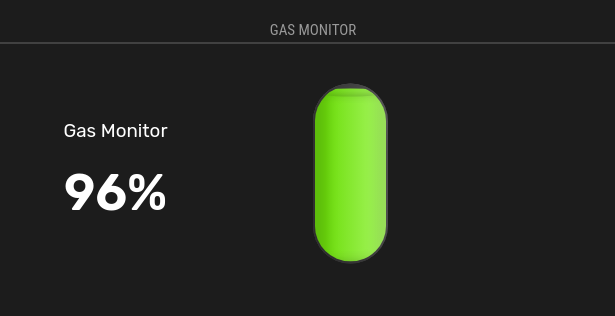

# MMM-GasMonitor

A [MagicMirror²](https://magicmirror.builders) module to display the status of your household gas

[](LICENSE)




## Dependencies
None

## Installation Instructions

In your terminal, go to your MagicMirror's Module folder:
````
cd ~/MagicMirror/modules
````

Clone this repository:
````
git clone https://github.com/mumblebaj/MMM-GasMonitor.git
````
Add the module to the modules array in the `config/config.js` file:
````javascript
        {
            module: "MMM-GasMonitor",
            position: "middle_center", // This can be any of the regions.
            disabled: false,
            config: {
              updateInterval: 86400000, //update every 24hrs
              dailyUsage: 0.987 //Calculated daily average usage
            }
          },
````

## Updating

To update the module to the latest version, use your terminal to go to your MMM-GasMonitor module folder and type the following command:

````
cd MMM-GasMonitor
git pull

````
## How to calculate your daily usage

- Calculate the number of days you use your gas for. 
- In my case I used my 48kg for a 117 days.
- Devide 49kg by 117 days and I get an average of 0.41kg per day used.

Next you would need to calculate 0.41kg as a percentage.
````
48kg = 100%
0.41kg = ?
To Solve for "?" we can cross-multiply and divide:
(0.41kg)*100% = (48kg) *?
0.41kg * 100% = 48kg * ?
41 = 48 * ?
Now, divide both sides by 48 to solve for ?
41/48 = ? * (48/48)
0.8541667 = ?
So, 0.41kg is approximately 0.8541667? of 48kg
````